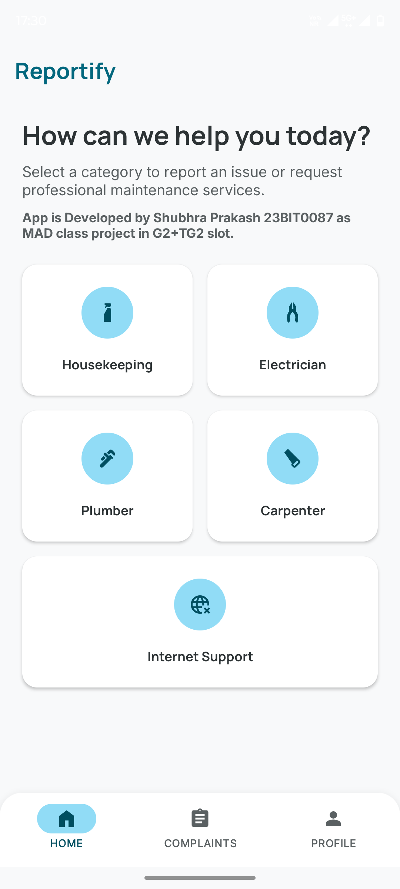
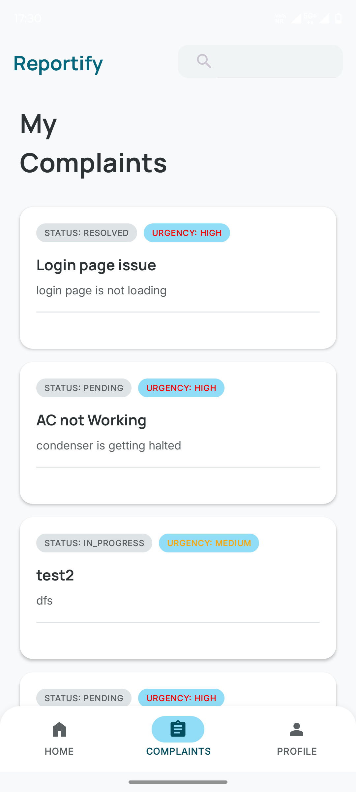
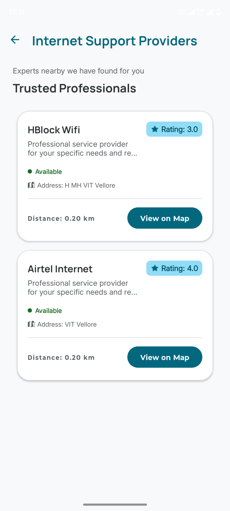
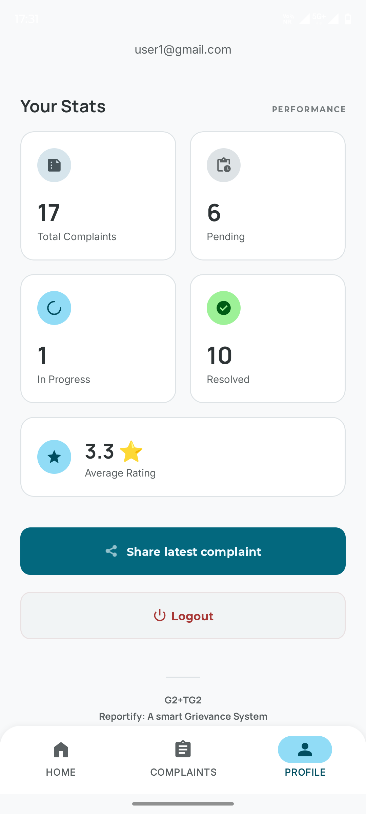

# Reportify

Reportify is an Android mobile application built to simplify how service-related complaints are reported, tracked, and resolved. It connects users with nearby service providers across multiple domains such as electrical, plumbing, housekeeping, and technical support.

The app enables efficient communication between users and providers, improves transparency across the complaint lifecycle, and supports reliable operation even in low-connectivity environments.

## Key Features

- Role-based workflow for users and service providers
- Service discovery by location and availability
- Complaint submission with detailed issue information
- Provider dashboard for complaint management and status updates
- Offline-first complaint handling using SQLite and Content Provider
- Automatic cloud synchronization when connectivity is restored
- Post-resolution provider ratings by users
- Secure authentication with Firebase Authentication
- Real-time data updates with Cloud Firestore
- Google Maps integration for location-aware provider discovery
- Profile management and real-time complaint status tracking

## How It Works

### 1. User Side

- Browse available service categories and providers
- Select providers based on proximity and availability
- Submit complaints with required details
- Track complaint progress in real time
- Rate provider performance after resolution

### 2. Provider Side

- Receive assigned complaints through a dedicated dashboard
- Manage incoming requests efficiently
- Update complaint status throughout each stage
- Improve service quality through measurable feedback

## Complaint Lifecycle

1. Complaint is submitted by user
2. Complaint is assigned to a selected provider
3. Provider acknowledges and starts resolution
4. Status is updated through each progress stage
5. Complaint is marked resolved
6. User gives rating and feedback

## Offline-First Architecture

Reportify is designed to remain functional without internet access.

- Complaint data is stored locally in SQLite when offline
- Data is exposed through a Content Provider for local access
- A sync mechanism automatically pushes local records to cloud storage once network connectivity returns
- This ensures continuity, reliability, and no loss of service requests

## Tech Stack

- Language: Java
- Platform: Android SDK
- Local Storage: SQLite
- Data Access Layer: Content Provider
- Authentication: Firebase Authentication
- Cloud Database: Cloud Firestore
- Maps and Location: Google Maps API and Android location services

## Screenshots

Add your app screenshots here after uploading images to a folder such as `assets/screenshots/`.

<p align="center">
  
  
  
  
</p>

## Project Structure

- `app/` - Main Android application module
- `app/src/main/` - Application source code and resources
- `gradle/` - Gradle wrapper and dependency management
- `build.gradle.kts` - Root Gradle build script
- `settings.gradle.kts` - Gradle module settings

## Getting Started

### Prerequisites

- Android Studio (latest stable recommended)
- Android SDK configured
- Java Development Kit (version compatible with your Android setup)
- Firebase project with Authentication and Firestore enabled
- Google Maps API key

### Setup

1. Clone the repository:

   ```bash
   git clone <your-repo-url>
   cd reportify
   ```

2. Open the project in Android Studio.
3. Sync Gradle files.
4. Ensure Firebase configuration is present:
   - `app/google-services.json`
5. Add required API keys and local properties as needed.
6. Build and run on emulator or physical Android device.

## Security and Reliability Notes

- Authentication is handled through Firebase Authentication
- Complaint data remains available offline to avoid workflow interruption
- Automatic synchronization ensures data consistency once online

## Use Cases

- Residents reporting household service issues quickly
- Local service providers managing requests in one place
- Organizations monitoring complaint resolution quality

## Future Enhancements

- Push notifications for complaint status changes
- Advanced analytics dashboard for providers and admins
- Multi-language support
- In-app chat between users and providers

## Contributing

Contributions are welcome. Feel free to fork the repository, create a feature branch, and open a pull request.

## License

Add your license information here (for example, MIT, Apache-2.0, or proprietary).
